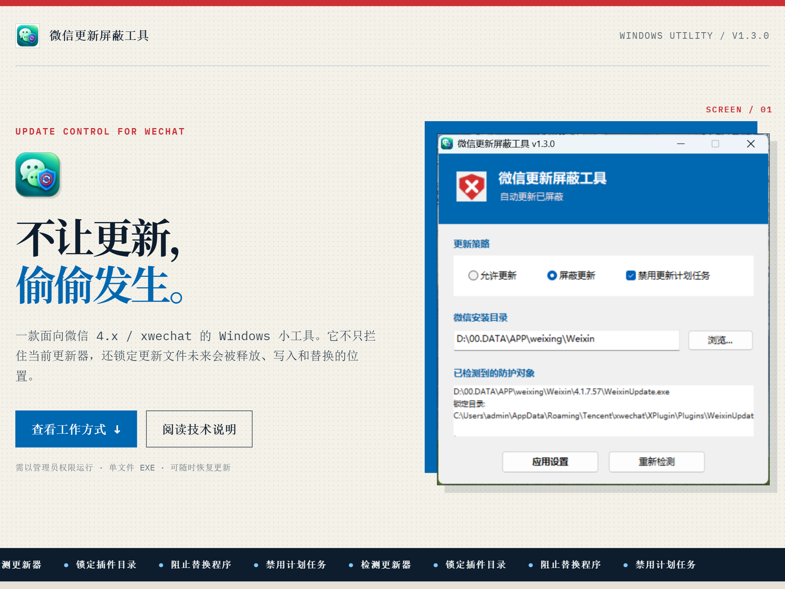
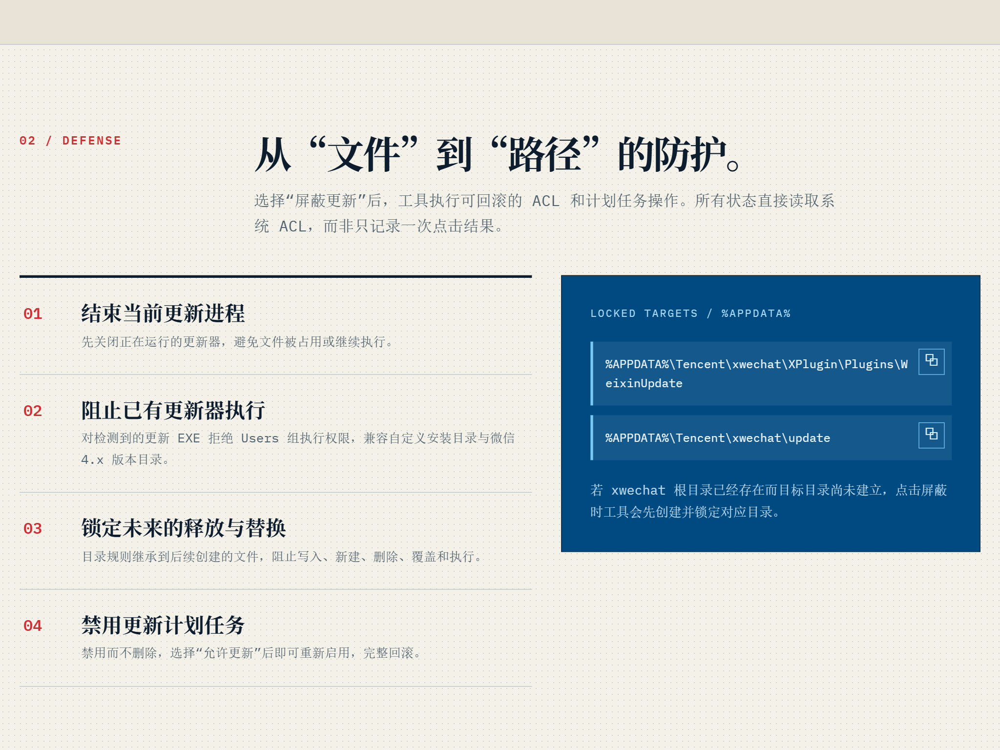
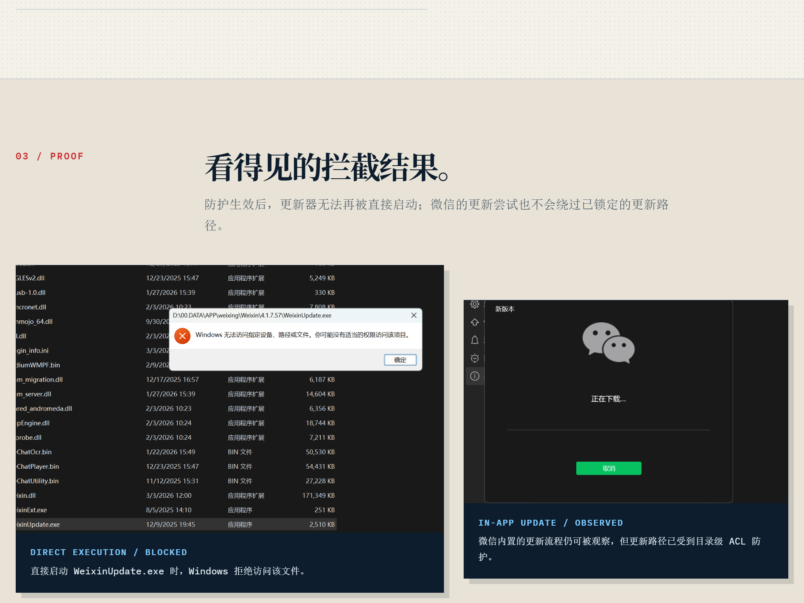

# 微信更新屏蔽工具 for windows

更新与否，应由用户自己决定。自己的电脑，自己做主。

本工具仅使用 Windows 自带的权限控制与计划任务设置，限制程序更新器的执行、写入与替换路径；不会修改微信主程序，也不会删除聊天记录、账号数据或其他个人文件。
---

面向微信 4.x / xwechat 的 Windows 更新防护小工具。它不会删除更新任务或修改微信主程序，而是以可恢复的 ACL 规则阻止更新器执行、释放与替换。



## 为什么需要它

仅对已存在的 `WeixinUpdate.exe` 拒绝执行并不彻底。xwechat 仍可能把新的更新器释放到插件目录，再写入 `update` 目录替换更新程序。

本工具将拦截点上移到更新路径：

- 结束当前运行中的更新进程；
- 对已发现的更新 EXE 拒绝 `Users` 组执行；
- 锁定 `%APPDATA%\Tencent\xwechat\XPlugin\Plugins\WeixinUpdate`；
- 锁定 `%APPDATA%\Tencent\xwechat\update`；
- 禁用微信更新计划任务（不删除，因此可以恢复）。

目录规则会继承至后续新建的文件，阻止写入、新建、删除、覆盖和执行。点击“允许更新”并应用设置后，工具会删除自身添加的拒绝 ACL，并按选项重新启用更新计划任务。



## 使用方式

下载 release or 自行编译 [wechat-update-blocke](https://github.com/hot-kitty/wechat-update-blocker/releases/download/v1.0.0/wechat-update-blocker.zip)

1. 以管理员权限运行 `dist\wechat-update-blocker.exe`。
2. 确认检测到的微信安装目录与防护对象；如未找到安装目录，点击“浏览...”手动选择包含 `WeChat.exe` 或 `Weixin.exe` 的目录。
3. 选择“屏蔽更新”，并点击“应用设置”。
4. 需要升级微信时，选择“允许更新”，点击“应用设置”，再从微信内完成更新。

工具会直接读取系统 ACL 判断状态，而不是只记录本次点击结果。



## 编译

项目自带绿色版 AutoIt 工具链，位于仓库根目录的 `autoit-tool\`。无需安装系统级 AutoIt。

### 一键构建

从**项目根目录** `autoit-tool-git` 运行：

```powershell
& ".\src\wechat-update-blocker\build.ps1"
```

脚本会依次执行 Au3Check 语法检查和 Aut2Exe x64 编译；成功后的产物为：

```text
dist\wechat-update-blocker.exe
```

构建通常需要 30–60 秒，具体取决于电脑性能。编译前请关闭正在运行的 `wechat-update-blocker.exe`，否则目标文件可能被占用。

### 单独检查语法

从项目根目录运行：

```powershell
& ".\autoit-tool\Au3Check.exe" ".\src\wechat-update-blocker\wechat-update-blocker.au3"
```

### 直接运行脚本调试

从项目根目录运行：

```powershell
& ".\autoit-tool\AutoIt3_x64.exe" ".\src\wechat-update-blocker\wechat-update-blocker.au3"
```

## 文件说明

| 路径 | 用途 |
| --- | --- |
| `wechat-update-blocker.au3` | AutoIt 源码 |
| `build.ps1` | Au3Check + Aut2Exe 一键构建脚本 |
| `wechat-update-blocker.ico` | 程序图标；编译后写入 EXE 资源 |
| `state-blocked.ico` / `state-allowed.ico` | 内嵌状态图标；运行时释放至临时目录 |
| `img/` | 介绍页与 README 使用的截图资源 |


## 注意事项

- 工具要求管理员权限，因为它需要修改文件 ACL 与计划任务。
- 屏蔽的是更新器及其更新路径，不会删除微信数据或主程序。
- 若 xwechat 根目录已经存在、但目标更新目录尚未创建，点击屏蔽时工具会预先创建并锁定它们。

## 免责声明

更新与否，应由用户自己决定。自己的电脑，自己做主。

本工具仅使用 Windows 自带的权限控制与计划任务设置，限制程序更新器的执行、写入与替换路径；不会修改微信主程序，也不会删除聊天记录、账号数据或其他个人文件。

所有限制均可恢复：在工具中点击“允许更新”，即可撤销本工具添加的权限规则，并按需恢复更新计划任务。

请注意，微信版本与更新机制可能随时变化。本工具旨在帮助你管理自动更新行为，不保证适用于所有微信版本或所有安装环境。若出现微信功能异常、需要安装安全更新或希望升级版本，请先恢复更新权限后再操作。

使用本工具即表示你了解并愿意自行承担由延迟更新、兼容性变化或第三方软件策略调整带来的影响。请仅在你拥有管理权和使用权的设备上使用。
